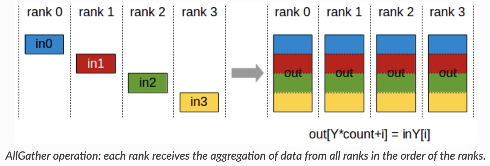
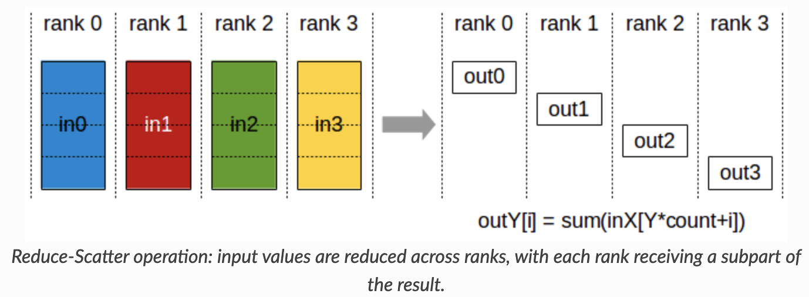
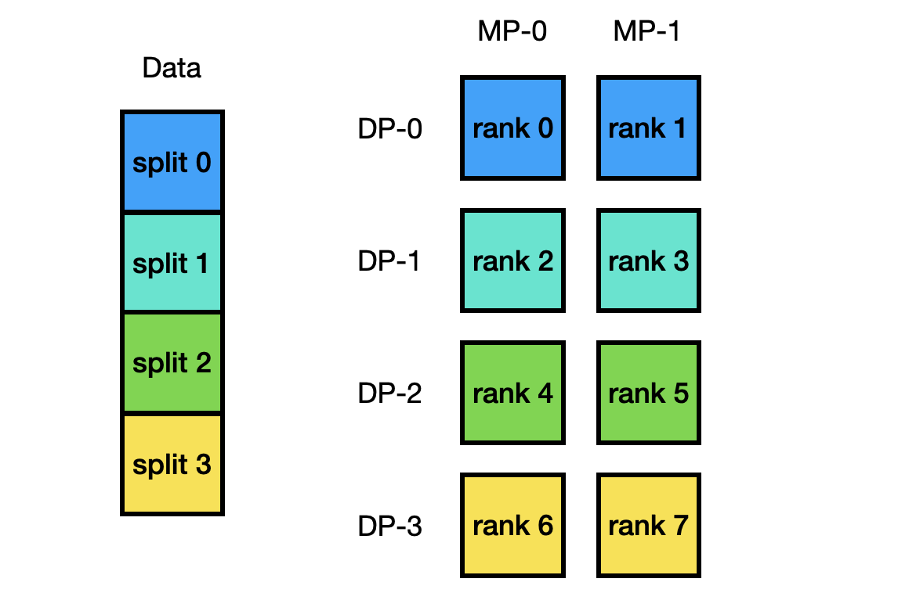
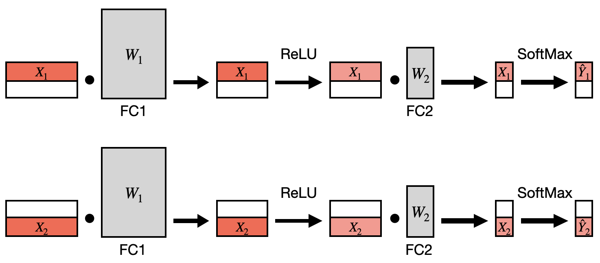
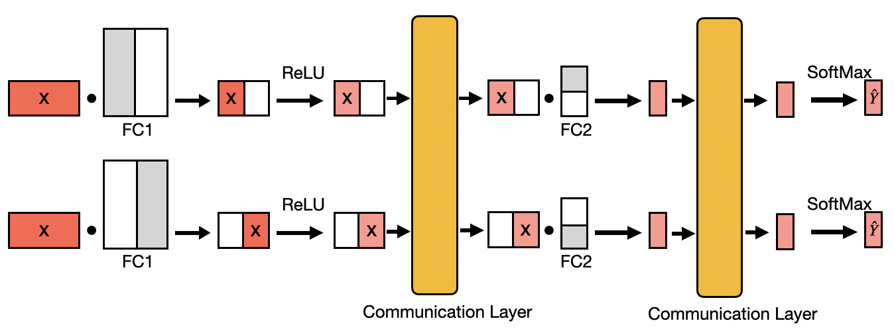
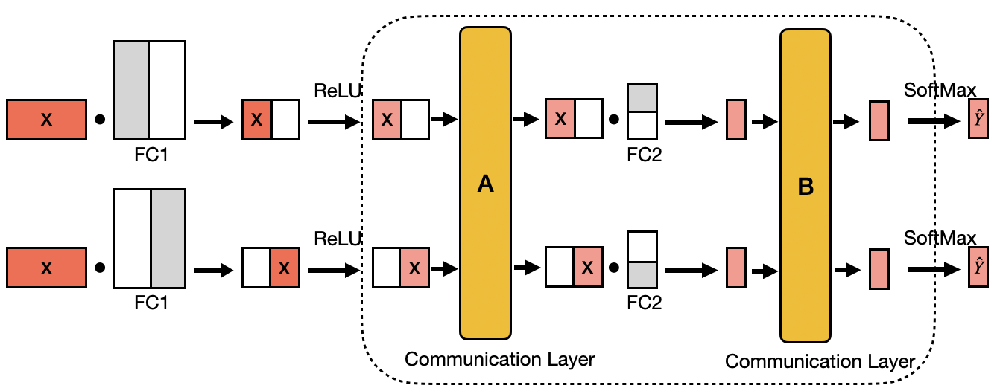

# Assignment 3 
In this assignment, we will explore how to implement the communication protocols for *Data Parallel* and 
*Tensor Model Parallel* training from scratch using Message Passing Interface ([MPI](https://mpi4py.readthedocs.io/en/stable/))
and NumPy.

As we will not be focusing on the actual forward computation
or backward propagation, we have provided you with a template code
that covers the forward and backward logics for you and leave only the communication
part for you to implement.

### Setup Guide

We will use the GHC clusters with multi-core machines for this assignment. To start with, you need to log into the GHC cluster `ghc[X].ghc.andrew.cmu.edu` where `X` is between 47 and 86 
with your **andrew_id** and **password**:

```bash
ssh [andrew_id]@ghc[X].ghc.andrew.cmu.edu
``` 

Then you should clone this repo and setup your virtual environment:

```bash
git clone https://github.com/mlsyscourse/assignment3.git
cd assignment3
pip install virtualenv
python3 -m venv work_space
source work_space/bin/activate
pip install -r requirements.txt
```
Once you have set up your virtual environment, you can resume your working space next time
by simply using:

```bash
ssh [andrew_id]@ghc[X].ghc.andrew.cmu.edu
cd assignment3
source work_space/bin/activate
```

You are not required to use the same `[X]`. In case some nodes are in maintenance, please
switch to some other nodes.

You are not required to use the GHC machines as long as your preferred platform contains MPI support with at least 8 cores.

### Part 0. Warm-up

The goal of this assignment is to walk you through a 2D parallel training pipeline step by step, which
involves tensor model and data parallel training. For tensor model parallel training we further consider naive tensor model parallel
and Megatron-style tensor model parallel.

To get familiar with our communication protocols we will start with playing around with the MPI package we have installed.

#### MPI Test
To verify that *mpi4py* has been setup correctly for distributed workloads, run:
```bash
mpirun -n 8 python mpi-test.py
```

For the GHC cluster machines, you can launch 8 processes at maximum with the `-n`
argument. We also provide you with some toy examples of the MPI functions in `mpi-test.py`,
 including `Allreduce(), Allgather(), Reduce_scatter(), Split()`.
Note that these four MPI functions are the only functions that are required and allowed by the assignment.

- ##### All-Reduce

<p align="center">

</p>

You can see an all-reduce example by running:
```bash
mpirun -n 8 python mpi-test.py --test_case allreduce
```

- ##### All-Gather

<p align="center">

</p>

You can see an all-gather example by running:
```bash
mpirun -n 8 python mpi-test.py --test_case allgather
```

- ##### Reduce-Scatter

<p align="center">

</p>

You can see a reduce-scatter example by running:
```bash
mpirun -n 8 python mpi-test.py --test_case reduce_scatter
```

- ##### Split

<p align="center">

</p>

Split is especially helpful when you are trying to apply MPI functions on a group basis.
You can see a split enabled group-wise reduction example by running:
```bash
mpirun -n 8 python mpi-test.py --test_case split
```

When playing with different test cases, try to get yourself familiar with the underline mpi functions 
and think about whether the output meets your expectation. 


#### Node Indexing Specifications

With a given data and model parallel size, we will assign nodes in a model parallel major for this assignment.
For instance, for `mp_size=2, dp_size=4` on 8 nodes we will group the nodes as shown below:

<p align="center">

</p>

### Part 1. Data Split for Data Parallel Training (10 pts)

For this part, your task is to implement the `split_train` function in `data/data_parallel_preprocess.py`.

The function takes in the training data and returns the data split according to the given `mp_size, dp_size` 
and `rank`. You should split data uniformly across data parallel groups while the model parallel groups can share the 
same data split within the same data parallel group. The data length is guaranteed to be divided equally by the
`dp_size` in all our test cases.

Hints: 
For `mp_size=2, dp_size=4`, you should split the data this way:
 
<p align="center">

</p>

To test your implementation, please run
```bash
python3 -m pytest -l -v tests/test_data_split.py
```

### Part 2. Layer Initialization (20 pts)

In this part, your task is to get necessary information for model and data parallel training, which is then
used to initialize the corresponding layers in your model.

For this assignment we will work with a simple two layer perceptron model as shown below:

<p align="center">

</p>

You are only required to implement the communications within two fully connective layers for forward and backward.
We have already taken care of the other stuffs i.e. the forward/backward computations and the training pipeline as these
are not relevant to the goal of this assignment.

For data parallel, we simply just split the batch of data equally across different data parallel groups:

<p align="center">

</p>

For naive tensor model parallel training, we split the weight matrix of both the fully connective layers (fc1, fc2)
along the output dimension (partition output) and shard them across different nodes. (Note that we don't shard different layers 
to different node as we don't consider pipeline parallelism here)

<p align="center">

</p>

For Megatron-style tensor model parallel training, we split the weight matrix of FC1 across the output dimension (partition output) 
and the weight matrix of FC2 across the input dimension and shard them across different nodes (reduce output).

<p align="center">

</p>

Given the above information, you need to implement the `get_info` function in `model/func_impl.py`.
The function gets essential information for later parts, including model/data parallel indexing,
model/data parallel communication groups, in/out dimensions for two FC layers. Please refers to the function
for more information and hints.

To test your implementation, please run
```bash
mpirun -n 8 python3 -m pytest -l -v --with-mpi tests/test_get_info.py
```

### Part 3. Naive Model Parallel Forward Communication (15 pts)

<p align="center">

</p>

As communication only happens in the FC2 layer for the model we defined, your task
in this part is to implement the forward communications in FC2 for the naive model parallel.
You need to implement the `naive_collect_forward_input` and `naive_collect_forward_output` functions in
`model/func_impl.py`, which corresponds to the two communication layers (A, B) shown above.

To test your implementations, please run
```bash
mpirun -n 4 python3 -m pytest -l -v --with-mpi tests/test_naive_mp_forward.py
```

### Part 4. Megatron-Style Model Parallel Forward Communication (15 pts)

<p align="center">

</p>

Similarly, in this part your task is to implement the forward communications in FC2 for 
the megatron-style model parallel. You need to implement the `megatron_collect_forward_input` and `megatron_collect_forward_output` 
functions in `model/func_impl.py`, which corresponds to the two communication layers (A, B) shown above.

To test your implementations, please run
```bash
mpirun -n 4 python3 -m pytest -l -v --with-mpi tests/test_megatron_mp_forward.py
```

### Part 5. Naive Model Parallel Backward Communication (20 pts)

In this part your task is to implement the backward communications in FC2 for 
the naive model parallel. You need to implement the `naive_collect_backward_output` and `naive_collect_backward_x` 
functions in `model/func_impl.py`, which are the communication functions for collecting `output_grad` (at communication layer B) 
and `grad_x` (at communication layer A) respectively.

To get a sense of how this function will be used in the training pipeline, please refer to `model/Layers.py`, but note that
you don't need to modify this file.

To test your implementations, please run
```bash
mpirun -n 4 python3 -m pytest -l -v --with-mpi tests/test_naive_mp_backward.py
```

### Part 6. Megatron-Style Model Parallel Backward Communication (10 pts)

Similarly, in this part your task is to implement the backward communications in FC2 for 
the megatron-style model parallel. You need to implement the `megatron_collect_backward_output` and `megatron_collect_backward_x` 
functions in `model/func_impl.py`

Hint: this part might be much simpler than you would have thought ^-^. But do walk through the process and 
understand why we can do this and the benefits of megatron-style model parallel.

To test your implementations, please run
```bash
mpirun -n 4 python3 -m pytest -l -v --with-mpi tests/test_megatron_mp_backward.py
```

### Part 7. Gradients Communication for Data Parallel Training (10 pts)

For data parallel training, each data parallel group will run its forward and backward pass
independently and aggregate the gradients afterwards for weight update. 

In this part, your task is to implement the communication function in all FC layers to get the
aggregated weight gradients. You need to implement the `collect_weight_grad` 
functions in `model/func_impl.py`

To test your implementations, please run
```bash
mpirun -n 4 python3 -m pytest -l -v --with-mpi tests/test_collect_weight_grad.py
```

### Part 8. Unified Training

Now that you have implemented all required communication functions for model/data parallel training.
The actual training can be tested by running:

```bash
mpirun -n [num_nodes] python unified_train.py --mp_size [mp_size] --dp_size [dp_size] [--megatron-mp]
```

where you can set `mp_size` and `dp_size` arbitrarily. Note that you need to set `num_nodes=mp_size*dp_size`.
You can add `--megatron-mp` flag to enable megatron-style model parallel, otherwise, the default is the naive model parallel.

For naive model parallel, you can only set `mp_size=1, 2` as the `mp_size` should be a common divisor for both layers'
`out_dim`, which in our case are 256 and 10.

For megatron-style model parallel, you can set `mp_size=1, 2, 4, 8`.

The maximum `num_nodes` you can set is 8. Now you can try different combinations and check out the logged training information.

Note that we will not grade this part, but we highly recommend you to try different configurations to get a better understanding of
different approaches in terms of communication/peak-memory trade-offs in distributed training.

### How to Submit Your Homework (Important!)

We will be using the auto-grading feature in autolab to score your submission for this assignment, so please follow the instructions 
carefully to align with the auto-grader hand-in requirements.

Now in your assignment3 root directory run
```bash
make handin.tar
```
Then you will see a `handin.tar` file under your root directory, please go to Autolab at [15-442](https://autolab.andrew.cmu.edu/courses/15442-s24) (https://autolab.andrew.cmu.edu/courses/15442-s24) and submit the file handin.tar 
under Homework-3. You should be able to see your score afterwards (you might need to wait for some time to let the autograder 
run your code.)

The maximum total score for this assignment is 100 pts and we will use this score as your final score for assignment 3. There is no limit on the
number of submissions.


#### References 

- some images credit to https://docs.nvidia.com/deeplearning/nccl/user-guide/docs/usage/collectives.html
